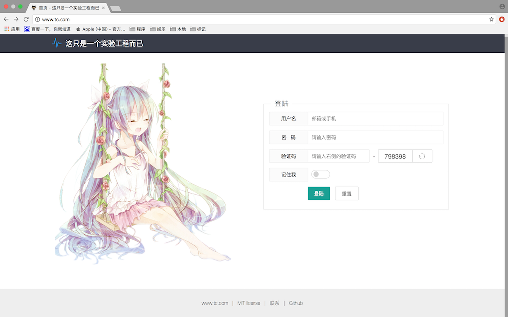

## tc

<!-- [](https://travis-ci.org/srarcbrsent/tc) -->
[]()
[]()

a hello world project 👻

not work, under construction ...

## 项目介绍

project-tc 是一个个人学习项目，目标是学习各种框架，中间件，学习系统框架集成。目标是打造一套从 **基础设施 - 前端UI - 后端组件 - 微服务架构 - 持续集成 - 自动化部署 - 系统检测** 的全方位解决方案。

## 特点

- 基于Spring来提供系统级的集成支持，所有组件均无缝集成到Spring框架，统一管理。
- 提供了大量的基础组件以及模版化的通用配置，即拿即用。
- 基于目前流行的微服务和(伪)前后端分离架构，高效易扩展。
- 代码精简，尽量不涉及业务，保证易学易用，快速上手。

## 技术选型

**前端框架类**

- jQuery: javascript库
- layui: UI组件库

**后端框架类**

- Spring-Framework: 框架集成, IoC, AoP, Tx
- SpringMVC: MVC框架
- Freemarker: 后端模版引擎
- Shiro: 认证, 授权, 会话管理框架
- MyBatis: ORM框架
- Druid: 数据库连接池
- Spring-Data-Mongodb: mongo 连接池
- Spring-Data-Redis: redis 连接池
- Spring-Retry: 重试框架
- Dubbox: 分布式服务发现, 治理, 调用框架
- Elastic-Job: 分布式作业调度框架
- Swagger: API管理框架
- Slf4j: 日志框架
- OkHttp3: http调用框架

**中间件类**

- zookeeper: 分布式协调服务
- redis(codis): 缓存服务
- rocketmq(metaq): 消息队列服务
- elasticsearch: 搜索引擎服务
- dubbo-admin(optional): dubbo控制台
- dubbo-monitor(optional): dubbo监控
- nginx: 请求分发地址映射服务
- mysql: 数据库
- mongodb: 文档数据库

**其他类**

- Maven: 项目构建
- MyBatisGenerator: MyBatis持久层生成
- Gulp: 前端编译
- Jenkins: 持续集成
- Checkstyle: 格式检查
- Findbugs: 静态检查

## 组织结构

```
tc
 |-- tc-api -- rpc接口
 |-- tc-apiimpl -- 微服务实现(default-port: 9090)
 |-- tc-apimodel -- rpc模型
 |-- tc-base -- 系统基础模块
 |-- tc-components -- 系统基础组件模块
 |-- tc-config -- 系统配置(包括nginx等的配置)
 |-- tc-demos -- 示例模块(包括一些示例代码)
 |-- tc-openapi -- 网关实现(default-port: 8080)
 |        |-- src/main/webapp/WEB-INF/frontend: 前端模块
 |-- tc-modules
          |-- tc-aliyun-support -- 阿里云邮件/短信模块
          |-- tc-cache-api -- 缓存服务接口
          |-- tc-cache-codis -- 基于codis的缓存组件实现
          |-- tc-cache-redis -- 基于redis的缓存组件实现
          |-- tc-commons-logger -- 特殊日志组件(重要日志存储到数据库等)
          |-- tc-commons-retry -- 重试组件
          |-- tc-commons-upload -- 上传组件
          |-- tc-commons-utils -- 特殊工具类(拼音/图片/Excel等)
          |-- tc-crawler -- 爬虫实现
          |-- tc-dubbox-support -- dubbox框架增强
          |-- tc-freemarker-support -- freemarker框架增强
          |-- tc-mbg-plugins -- MyBatisGenerator增强插件
          |-- tc-mq-metaq -- Metamorphosis组件
          |-- tc-mq-rocketmq -- RocketMQ组件
          |-- tc-rpc-httpx -- http调用组件
          |-- tc-sch-elasticjob -- 分布式定时任务组件
          |-- tc-se-elasticsearch -- elasticsearch搜索引擎组件
          |-- tc-servlet-support -- servlet增强组件
          |-- tc-spring-reactive -- Spring5.0 Demo
```

### 模块依赖

    TODO

### 如何构建

**warning: 目前工程处于不稳定状态**

- 准备工作

    1. JDK8
    2. Maven
    3. NodeJS & npm
    4. 本地添加以下 hosts

```shell
# tc
127.0.0.1 www.tc.com tc.com
127.0.0.1 openapi.tc.com
127.0.0.1 api.tc.com
127.0.0.1 resource.tc.com
127.0.0.1 static.tc.com
127.0.0.1 zk.tc.com
127.0.0.1 rds.tc.com
127.0.0.1 mtq.tc.com
127.0.0.1 es.tc.com
127.0.0.1 ws.tc.com
127.0.0.1 rdb.tc.com
127.0.0.1 mongodb.tc.com
```

- 编译前期依赖包(由于一些第三方框架没有上传到maven中央仓库，所以手动编译依赖到本地)

```shell
git clone -b master https://github.com/killme2008/Metamorphosis.git &&
mvn -f Metamorphosis/pom.xml clean install &&
git clone -b master https://github.com/dangdangdotcom/dubbox.git &&
mvn -f dubbox/pom.xml clean install &&
git clone -b master https://github.com/apache/incubator-rocketmq.git &&
mvn -f incubator-rocketmq/pom.xml clean install
```

- 搭建工程
    
    1. 克隆并导入项目 `git clone -b master https://github.com/srarcbrsent/tc.git`
    2. 在 tc-openapi/src/main/webapp/WEB-INF/frontend 下执行 `npm install` 安装前端编译模块

- 搭建中间件
    
    1. 本地安装并启动 zookeeper, redis, nginx, metaq 服务，其中 nginx 参考 tc-config 工程中的 nginx/nginx.conf 配置文件(注意修改静态资源路径)
    2. 调整 tc-openapi/src/main/resources/properties/dev & tc-apiimpl/src/main/resources/properties/dev 下的配置文件指向(dev文件夹代表使用tc_dev profile启动)
    3. 创建MySQL数据库，执行tc-config/rds中的脚本初始化表

- 启动

    1. 编译工程, 工程根目录下 `clean install`
    2. 启动 tc-apiimpl(default-port: 9090), `clean install -Ptc_dev jetty:run`
    3. 启动 tc-openapi(default-port: 8080), `clean install -Ptc_dev jetty:run`
    4. 访问 http://www.tc.com

- 其他

    1. 格式检查: 工程根目录下 `checkstyle:check`
    2. 静态检查: 工程根目录下 `clean install` 后在 `findbugs:check`

### 部署结构

    TODO

### 屏幕快照

    TODO

<!--  -->

### 关于作者

    TODO


